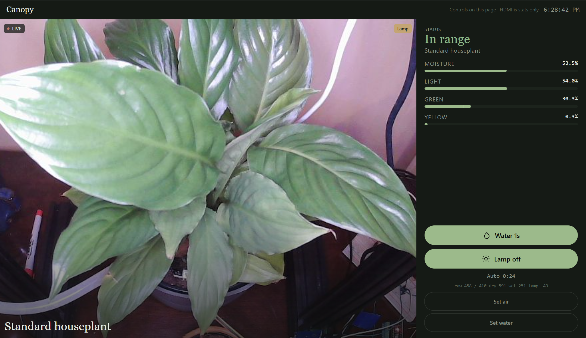

# Canopy + Cloudflare Tunnel + Access

Secure remote access to the existing **Canopy** plant dashboard using **Cloudflare Tunnel** (outbound-only) and **Cloudflare Access** (login gate).

**This repo does not rebuild Canopy.** Station app: [jacoblackner1/canopy-station](https://github.com/jacoblackner1/canopy-station).



## Architecture

```
You (browser) → Cloudflare Access (email OTP allowlist)
              → Cloudflare Tunnel (named)
              → cloudflared on Orange Pi (outbound)
              → http://127.0.0.1:5000  (existing Flask UI)
```

Verified in `plant_dashboard.py`: `flaskHost=0.0.0.0`, `flaskPort=5000`. LAN `http://<pi>:5000/` stays open. HDMI stats kiosk is unchanged. No router port-forward.

Official docs:

- [Create a tunnel](https://developers.cloudflare.com/cloudflare-one/connections/connect-networks/get-started/create-remote-tunnel/)
- [Local config file](https://developers.cloudflare.com/cloudflare-one/connections/connect-networks/configure-tunnels/local-management/configuration-file/)
- [Linux service](https://developers.cloudflare.com/cloudflare-one/connections/connect-networks/configure-tunnels/local-management/as-a-service/linux/)
- [Access OTP](https://developers.cloudflare.com/cloudflare-one/integrations/identity-providers/one-time-pin/)

## Short path

See **[docs/INSTALL.md](docs/INSTALL.md)** (joint station + tunnel steps).

```bash
cd ~/canopy-station
git pull
sudo ./scripts/install_tunnel.sh
```

Then: named tunnel → credentials in `/etc/cloudflared/` → fill UUID/hostname → Access allowlist your email → reboot-safe.

## Repo layout

| Path | Purpose |
|------|---------|
| `config/config.example.yml` | Ingress → `http://127.0.0.1:5000` (UUID/hostname placeholders) |
| `systemd/cloudflared.service` | Starts after `canopy-station.service` |
| `scripts/install-cloudflared.sh` | Binary + `cloudflared` user |
| `scripts/validate-config.sh` | Reject leftover UUID/hostname placeholders |
| `scripts/healthcheck.sh` | Local UI on :5000 + service check |
| `docs/INSTALL.md` | Joint install |
| `docs/ACCESS-POLICY.md` | Email allowlist + OTP |
| `docs/SECURITY-CHECKLIST.md` | Camera / Water / Lamp |
| `docs/ORANGE-PI-NOTES.md` | Bind facts |

## Secrets policy

Placeholders only in git. Never commit tunnel credentials JSON, `cert.pem`, or install tokens.

## Success

Incognito / cellular: `https://canopy.yourdomain.com` → Access → existing Canopy UI (LIVE cam + Water / Lamp). Home Wi-Fi still uses `http://<pi>:5000/` with no Cloudflare.
